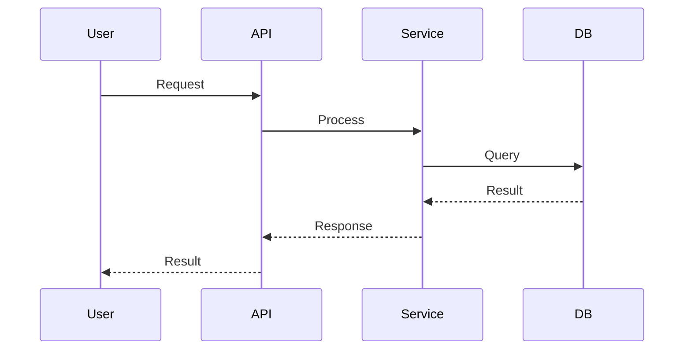

## Technical Approach

<!-- High-level implementation strategy (1-2 paragraphs) -->

## Architecture Decisions

### Decision: <!-- decision title -->
- **Decision**: <!-- what was decided -->
- **Rationale**: <!-- why this approach, citing BR-# from specs -->
- **Alternatives Rejected**: <!-- what was considered and why not -->

## File Manifest — Creates

| Path | Purpose | Traces To |
|------|---------|-----------|
| <!-- src/path/file.ts --> | <!-- what this file does --> | <!-- BR-#, AC-# --> |

## File Manifest — Modifies

| Path | What Changes | Traces To |
|------|-------------|-----------|
| <!-- src/path/existing.ts --> | <!-- specific modification --> | <!-- BR-#, AC-# --> |

## Do-Not-Touch List

<!-- Files explicitly outside scope. Any file NOT in creates/modifies is implicitly DNT. -->
<!-- List files that might seem related but must not be changed. -->
| Path | Reason |
|------|--------|
| <!-- src/path/fragile.ts --> | <!-- why this must not be touched --> |

## Data Flow

<!-- Sequence diagram (Mermaid) or narrative description of how data moves -->
<!-- through the system for the primary use case. -->

